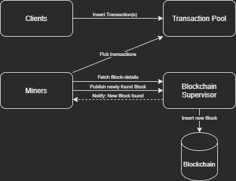
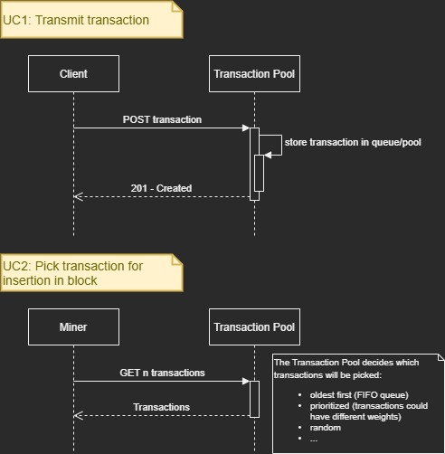
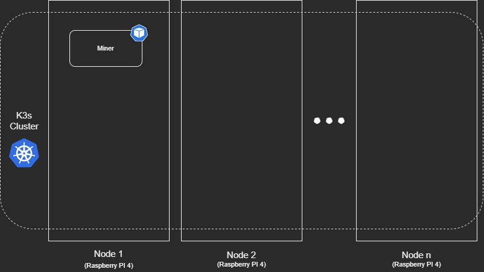

# Pseudo Blockchain Project

## Table of Contents

1. [Outline](#Outline)
2. [Architecture](#Architecture)
    - [Building Block View](#Building-Block-View)
    - [Runtime View](#Runtime-View)
    - [Deployment View](#Deployment-View)
3. [Components](#Components)
    - [Clients](#Clients)
    - [Transaction Pool](#Transaction-Pool)
    - [Miners](#Miners)
    - [Blockchain Supervisor](#Blockchain-Supervisor)
    - [Blockchain](#Blockchain)
4. [Additional (future) Components](#Additional-(future)-Components)

## Outline

This project

## Architecture

### Building Block View

### Runtime View

### Deployment View

## Components

This Project will consist of the following components:

### Clients

Clients that generate dummy transactions.

### Transaction Pool

When users create transactions and submit them to the network, they are inserted into a pool. Miners can pick transactions from this pool and include them in a block.

### Miners

Can use different forms of [consensus algorithms](https://www.coindesk.com/short-guide-blockchain-consensus-protocols), like:

- Proof of work
- Proof of stake
- Proof of activity
- ...

### Blockchain Supervisor

- Sets difficulty+Consensus
- Reviews proof-of-work
- Manages Blockchain (inserts new found blocks)
- Provides information about current Block (hash+id)
- Notifies Miners when a new valid Block has been found and accepted

### Blockchain (Database)

Database where Blockchain is stored.

## Additional (future) Components

- Service that makes the blockchain graphically visible