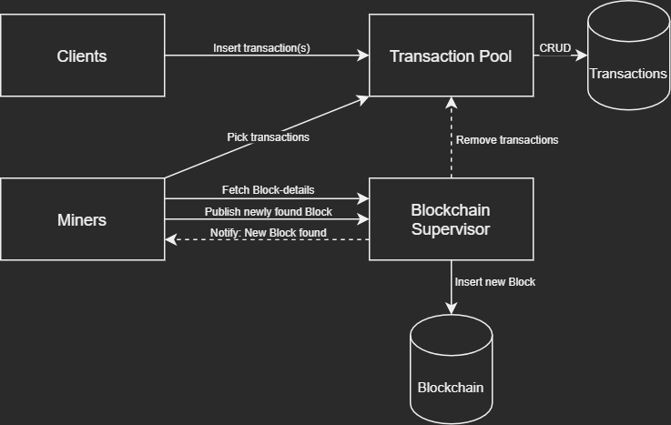
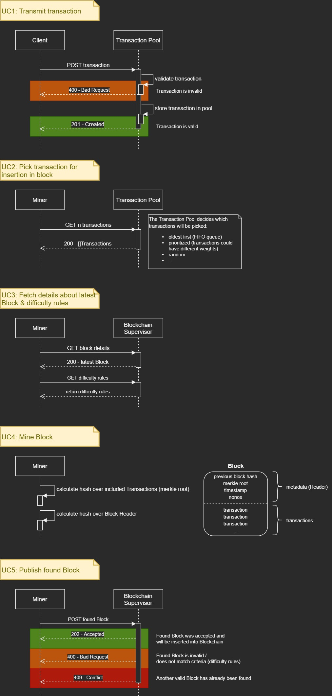

# Dummy Blockchain

## Table of Contents

1. [Outline](#Outline)
2. [How to run](#How-to-run)
3. [Components](#Components)
    - [Transaction Clients](#Transaction-Clients)
    - [Transaction Pool](#Transaction-Pool)
    - [Miners](#Miners)
    - [Blockchain Supervisor](#Blockchain-Supervisor)
    - [Models](#Models)
4. [Architecture](#Architecture)
    - [Building Block View](#Building-Block-View)
    - [Runtime View](#Runtime-View)
    - [Deployment View](#Deployment-View)

## Outline

This project creates a "dummy"-blockchain scenario utilizing multiple microservices which are orchestrated via Kubernetes.

**It serves as an educational project in order to:**

- dive into [Go](https://golang.org/)
- become familiar with [GitHub](https://github.com/) & [GitHub Actions](https://docs.github.com/en/actions) (the author's a [GitLab](https://gitlab.com)-guy...)
- increase the author's practical experience with [Kubernetes](https://kubernetes.io/)
- understand this [Blockchain](https://en.wikipedia.org/wiki/Blockchain)-thingy inside-out
- evaluate some [CNCF graduated & incubating projects](https://www.cncf.io/projects/) like [NATS](https://nats.io/), [Jaeger](https://www.jaegertracing.io/), [Flux](https://fluxcd.io/), ...

**Disclaimer:**
>This project does not claim any correctness regarding topics such as Blockchain, etc.

## How to run

The easiest way tu run this project is via [k3d](https://k3d.io/)

```bash
# Create k3s cluster
k3d cluster create mycluster -p 8010:80@loadbalancer --agents 2 --servers 1
kubectl config use-context k3d-mycluster

# Start
kubectl apply -k ./k8s/

# Teardown
kubectl delete -k ./k8s/
```

## Components

This Project will consist of the following components:

Component | Repository | Status
:--- | :--- | :---
Transaction Clients | [philohsophy/transaction-client](https://github.com/philohsophy/transaction-client) | To be implemented
Transaction Pool | [philohsophy/transaction-pool](https://github.com/philohsophy/transaction-pool) | v0.1.1
Miners | [philohsophy/dummy-blockchain-miner](https://github.com/philohsophy/dummy-blockchain-miner) | To be implemented
Blockchain Supervisor | [philohsophy/dummy-blockchain-supervisor](https://github.com/philohsophy/dummy-blockchain-supervisor) | To be implemented
Models | [philohsophy/dummy-blockchain-models](https://github.com/philohsophy/dummy-blockchain-models) | v0.1.0-alpha

### Transaction Clients

Clients generate transactions.

### Transaction Pool

When users create transactions and submit them to the network, they are inserted into a pool. Miners can pick transactions from this pool and include them in a block.

### Miners

Can use different forms of [consensus algorithms](https://www.coindesk.com/short-guide-blockchain-consensus-protocols), like:

- Proof of work
- Proof of stake
- Proof of activity
- ...

### Blockchain Supervisor

- Sets difficulty+Consensus
- Reviews proof-of-work
- Manages Blockchain (inserts new found blocks)
- Provides information about current Block (hash+id)
- Notifies Miners when a new valid Block has been found and accepted

### Models

Repository with shared data models used by all services:

- Transaction
- Block

Also provides convinience functions like schema-validation for each model

## Architecture

### Building Block View



### Runtime View



### Deployment View

TODO
